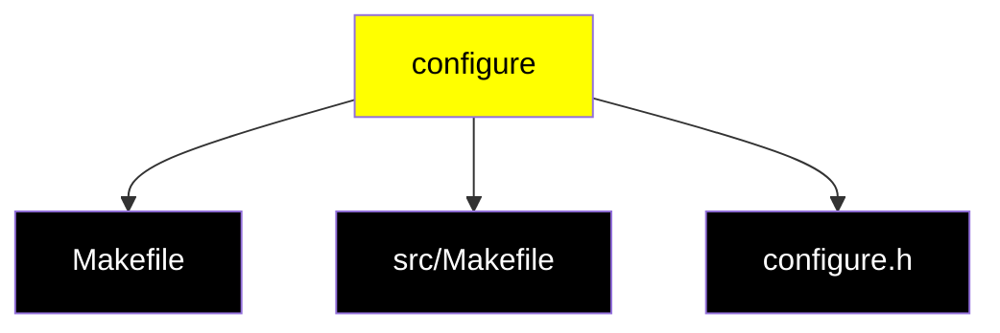
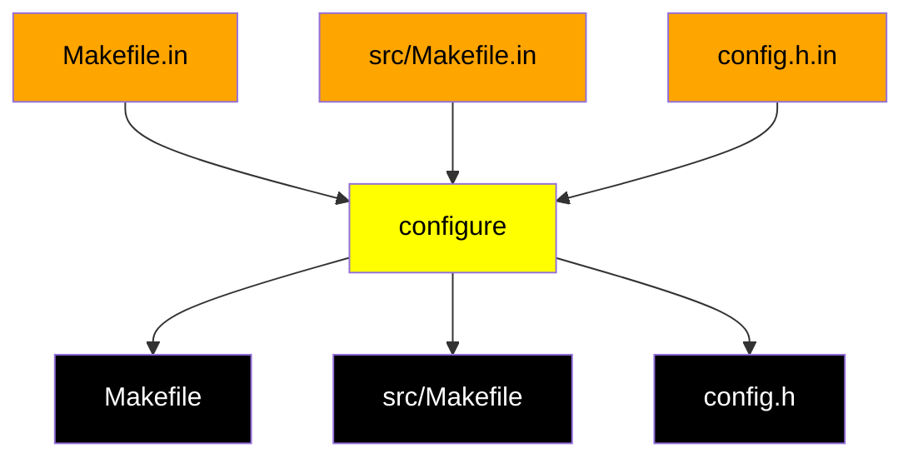
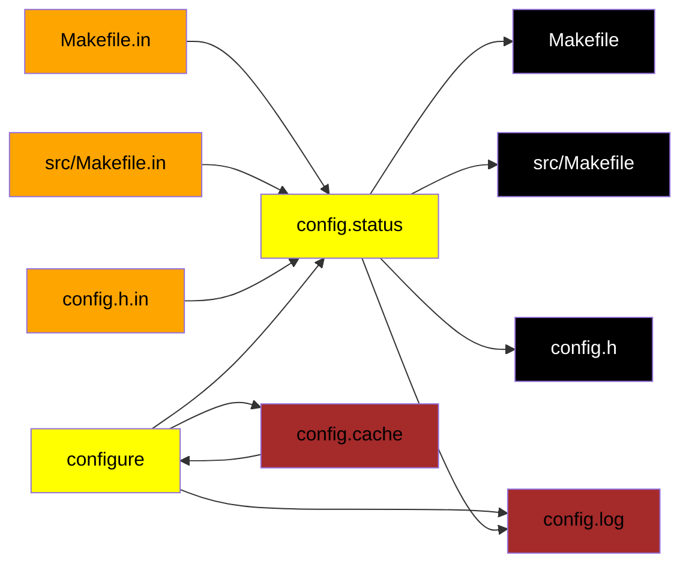
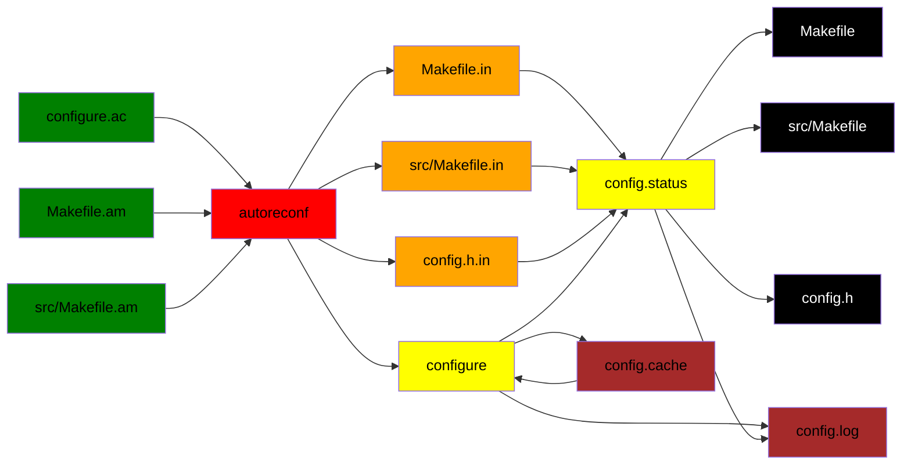
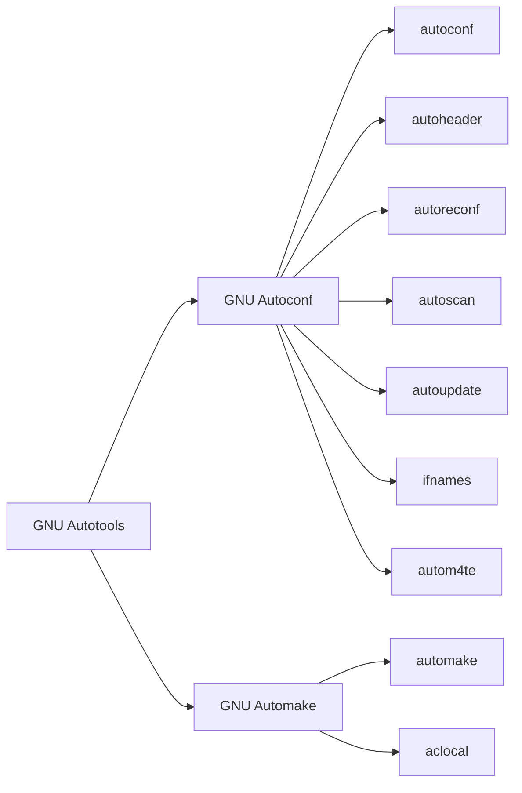
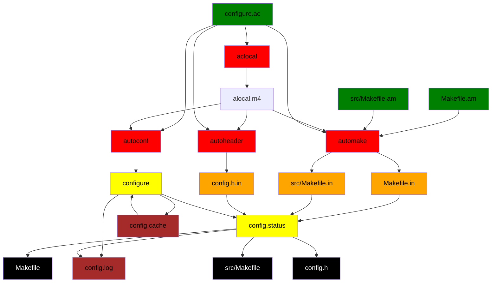

`GNU Autotools` - это набор из нескольких утилит (`automake`, `autoreconf`, ...), которые при совместном использовании предоставляют разработчику удобную среду для сборки, компиляции и распространения своих проектов.

Очень важной особенностью GNU Autotools является то, что они нацелены на поддержку и распространение проектов, *написанных согласно стандарту GNU* - см. [GNU Coding Standarts](https://www.gnu.org/prep/standards/standards.html). Но, конечно же, подчиняться *всем* правилам стандарта при использовании Autotools не обязательно (хотя от многих из них просто так уйти не получится).

Стоит также понимать, что GNU Autotools не зависят от конкретного языка программирования, и по аналогии с Make, представляют собой очень сложную надстройку над обычными скриптами командной оболочки. С помощью Autotools можно собирать проекты как на C, так и на C++, Python, C#, и так далее.
# Зачем нам нужны Autotools
## Входные условия
Предположим, у нас есть некоторый проект на C/C++, и мы хотим, чтобы пользователи на разных машинах могли собрать его.

Поэтому мы решаем поставлять наш проект в формате исходного кода, который потом должен быть скомпилирован на целевом устройстве.

С портированием проекта на другие системы есть множество проблем:
1. На разных машинах могут быть процессоры разной архитектуры (RISC-V, ARM, x64, ...) и разной разрядности
2. На разных машинах могут быть разные ОС
3. На разных машинах могут быть установлены разные компиляторы, разных версий и с разными реализациями рантайма (`clang`, `msvc`, `gcc`, `musl`, ...)

Кроме того, существуют проблемы касательно самого исходного кода, даже на уровне совершенно стандартных операций (на примере языка C):
1. Некоторые стандартные функции есть не на всех системах (`strtod`)
2. У некоторых стандартных функций на разных системах могут быть разные названия (`strchr()` и `index()`)
3. У стандартных функций на разных системах могут быть разные прототипы (`setpgrp(void)` и `setpgrp(int, int)`)
4. Стандартные функции на разных системах могут вести себя по-разному (например, вызов `malloc(0)`)
5. Стандартные функции могут быть определены в разных разделяемых библиотеках (например, для математических функций - `libm.so` и `libc.so`)
6. Стандартные функции могут быть объявлены в разных заголовках (`string.h`, `strings.h`, `memory.h`)
И плюс к этому, проект может использовать сторонние зависимости, которые тоже в свою очередь по реализации могу отличаться на разных системах. Самый банальный пример - это работа с графикой через API конкретной платформы.

Нам, как разработчикам, нужно разобраться, как со всем этим работать

## Примитивные решения
### 1. Заполнение кода директивами `#if`/`#else`
```c
#if !defined (CODE_EXECUTABLE)
static long pagesize = 0;
#if defined (EXECUTABLE_VIA_MMAP_DEVZERO)
static int zero_fd ;
#endif
if (! pagesize)
{
#if defined (HAVE_MACH_VM)
	pagesize = vm page size ;
#else
	pagesize = getpagesize ();
#endif
#if defined (EXECUTABLE_VIA_MMAP_DEVZERO)
	zero_fd = open ("/dev/zero", O_RDONLY, 0644) ;
	if (zero_fd < 0)
	{
		fprintf (stderr, "trampoline: Cannot open /dev/zero! \n") ;
	abort() ;
	}
#endif
}
#endif
```
Такой код:
- неудобно читать
- неудобно изменять
- неудобно поддерживать

В процессе написания программы, вместо мыслей о реальной логике программы, мы будем заняты написанием повторяющегося неаккуратного кода для учёта мелких незначительных деталей разработки под конкретную систему.
### 2. Макросы для замены кода
Если на целевой платформе нет нужной нам функции, мы могли бы определить её через макрос:
```c
#if ! HAVE_FSEEKO && ! defined fseeko
#define fseeko(s, o, w) ((o) == (long)(o) \
				? fseek(s, o, w) \
				: (errno = EOVERFLOW, -1))
#endif
```
Но определять через макросы каждую функцию было бы ужасно утомительно. Да и в целом использовать такие макросы это не очень хорошая практика.
### 3. Ручная замена функций
Если какой-то функции нет на целевой платформе, мы могли бы сами в отдельном файле переписывать эту функцию и линковать её с основной программой.
```c
char* strdup(const char *s)
{
	sizt_t len = strlen(s) + 1;
	void* new = malloc(len);
	if (new == NULL)
	{
		return NULL;
	}
	return char* memcpy(new, s, len);
}
```
## Пару слов про Make
Как первый шаг к решению этих проблем разберём использование утилиты `make` и проблемы, которые она решает.
### Сборка без Make
Напрямую, чтобы собрать программу, нам нужно запустить компилятор для каждого "модуля" этой программы и получить для него готовый объектный файл, и потом объектные файлы объединялись бы с помощью линковщика в готовую программу. Конечно же, эта схема сильно упрощена, но суть примерно такая. 

Чтобы напрямую при помощи командной строки собрать даже небольшой проект из трёх компонентов, нужно писать очень много текста:
```bash
g++ -c 1.cpp
g++ -c 2.cpp
g++ -c 3.cpp
g++ -c main.cpp
g++ 1.o 2.o 3.o main.o -o main
./main
```
И это мы ещё не писали каких-то аргументов для компилятора и для сборщика, не подключали сторонние библиотеки и вообще - собрали маленький простенький проект.

Вы можете возразить, что весь этот код можно просто записать в `shell`-скрипт и не прописывать его каждый раз:
```bash
sh compile.sh
./main
```
И это, конечно, делает жизнь чуть легче.

Но что, если из огромного проекта на сотни объектных файлов нам потребовалось поменять только две строчки кода?
Тогда нам придётся, если использовать единый скрипт, перекомпилировать *весь* проект ради одного небольшого изменения.

Конечно, можно написать отдельный скрипт для линковки, и отдельный скрипт для компиляции каждого отдельного файла... Но тогда нам придётся при каждой новой компиляции чётко помнить, какие объектные файлы нужно пересобирать, и по итогу, мы не сильно уйдём от начальной структуры, где мы для каждого файла отдельно прописывали команды компиляции.

Есть и другие проблемы при использовании самописных `shell`-скриптов:
- Отсутствие единого стандарта: каждый пишет, как он хочет
- Много лишней повторяющейся работы
- Невозможность запустить компиляцию целевой программы в несколько потоков
- ...
### Использование Make
Описанные выше проблемы помогает решить утилита `make`, разработанная ещё в 1978 году.

Утилита `make` позволяет с помощью унифицированного синтаксиса записывать правила сборки больших проектов.

Правила сборки для `make` записываются в специальном файле `Makefile`. 

`Makefile` для нашего синтетического примера выглядел бы примерно так:
```make
1.o : 1.cpp
	g++ -c 1.cpp
2.o: 2.cpp
	g++ -c 2.cpp
3.o : 3.cpp
	g++ -c 3.cpp
main.o : main.cpp
	g++ -c main.cpp
main: 1.o 2.o 3.o main.o
	g++ 1.o 2.o 3.o main.o -o main
```
Стоит отметить, что этот `Makefile` не очень аккуратный, и вообще-то, так писать лучше не стоит. Но мы его рассматриваем чисто для примера.

Что же здесь записано?

Как видим, сначала тут прописываются цели сборки, потом прописываются файлы/другие цели сборки, необходимые для этой, и сама команда сборки:
```make
цель_сборки: зависимость_1 зависимость_2 ...
	команда_для_сборки
```
`команда_для_сборки` - это обычная команда для выполнения в командной оболочке (`bash`, `fish`, ...).

Чтобы выполнить команду для сборки определённой цели, нужно вызвать команду `make`, и как аргумент передать название цели:
```bash
make 1.o
```
При таком вызове будет выполнена команда `g++ -c 1.cpp`, и сгенерируется файл `1.o`

Если же прописать:
```bash
make main
```
Утилита `make` увидит, что для цели `main` ей нужно собрать цели `1.o`, `2.o`, `3.o`, `main.o` - и она в указанном порядке выполнит их. И только после этого будет выполнена команда для `main`.

Как итог, "под капотом" будут выполнены те же команды, которые были прописаны вручную ранее, но в данном случае вместо ручного прописывания всех команд мы выполняем всего один простой вызов `make`.

Кроме того, утилита `make` отслеживает дату изменения файлов, используемых при сборке. И поэтому, если мы изменим в проекте только один файл, `make` отследит этот момент и пересоберёт только цель, связанную с этим одним файлом, а не весь проект целиком.

Вообще, в целом, утилита `make` - это чуть более удобная обёртка над теми же `shell`-скриптами. С помощью `make` можно выполнять вообще любые команды, например, можно вывести на экран `Hello World`:
```make
hello_world:
	echo "Hello World"
```

```bash
make hello_world
```

...+ ко всему перечисленному, в Makefile можно определять локальные переменные, можно использовать переменные окружения, оставлять специальные параметры сборки, и т.д. и т.п.
Пример сложного и хорошо записанного `Makefile` можно посмотреть [здесь](https://gitlab.com/sortie/meaty-skeleton/-/blob/master/kernel/Makefile?ref_type=heads).

Также частой практикой является создание в проекте "вложенных" `Makefile`-ов: один главный `Makefile`, которые генерирует готовое решение, вызывает `make` для других, "вложенных" `Makefile`-ов, которые собирают отдельные компоненты программ. Так можно разделить логику сборки проекта целиком и его отдельных частей.
### Стандартные цели сборки Make
Так как `make` можно использовать не только для непосредственно компиляции программы, но и вообще в принципе для чего угодно, с помощью `make` зачастую задают и инструкции для установки программы в системе (см. Unix-утилиту `install`), для очистки сборочных файлов, для деинсталляции пакета из системы, и так далее.

В основном, определяют следующие стандартные цели:
- `make all` - сборка программ, библиотек, документации, ...
- `make install` - установка чего-либо 
- `make uninstall` - деинсталляция чего-либо
- `make clean` - стереть всё, что было собрано (противоположность `make all`)
- `make check` - запустить тесты, если такие есть
- `make install check` - проверить установленные программы или библиотеки, если это поддерживается
- `make dist` - создать `PACKAGE-VERSION.tar.gz` - `tar`-архив с файлами проекта для установки на конкретной системе

Если вызвать `make` без указания цели, выполняется цель `all`.
## Почему Make недостаточно
Конечно, `make` значительно упрощает процесс сборки программ по сравнению с использованием обычных `shell`-скриптов. Но те же самые проблемы, которые были озвучены ранее, остаются и с использованием `make`:
- Различие версий компиляторов и библиотек на разных системах
- В принципе разные компиляторы на разных системах
- Отличающиеся флаги и аргументы компилятора на разных машинах
- Проблемы с самим исходным кодом, перечисленные ранее
- и т.д.

Таким образом, если при компиляции и сборке проекта ограничиться только использованием `make`, мы значительно упростим процесс сборки программы, но всё равно нам пришлось бы заставлять пользователей программы вручную менять скрипты в `Makefile` и, возможно, даже менять что-то в самом исходном коде.
## Скрипт configure
В какой-то момент, для решения вышеприведённых проблем, стандартным решением стал скрипт `configure` - разработчики вручную писали скрипт, который сканировал систему, определял её основные параметры, искал системные заголовки, библиотеки и прочее, и на основе этого генерировал `Makefile`, из которого уже собирался и устанавливался требуемый пакет.

Со временем, чтобы как-то унифицировать процесс сборки различных программ, было принято решение стандартизировать API скрипта и его схему работы. Далее рассмотрим то, как же он функционирует на практике.

...на выходе `configure` генерирует несколько файлов:
- `configure.h` - файл со всеми необходимыми включениями библиотек и дефайнами
- `Makefile` - `Makefile` для сборки всего проекта под конкретную платформу
- `src/Makefile` - вложенные `Makefile`ы для отдельных компонентов


И вот так выглядит типичный процесс установки программы с использованием `make` и `configure:`
```bash
tar zxf helloworld-1.0.tar.gz # распаковываем архив с исходниками
cd helloworld-1.0 # переходим в папку с исходниками
./configure # запуск скрипта configure
make # компилируем и собираем проект 
make check # проверяем, собралось ли всё правильно
sudo make install # устанавливаем собранный проект в систему
make installcheck # проверяем корректность устновки
```
### Базовый процесс установки
#### Файловая иерархия
Наш проект следует установить где-то в системе, а если это библиотека, нужно ещё и в какую-то локацию положить динамические/статические либы и заголовочные файлы.

Учитывая все эти сложности, скрипт должен понимать, как эти папки и файлы располагаются в системе и как они зависят друг от друга.

| Переменная  | Значение по умолчанию |
| ----------- | --------------------- |
| prefix      | /usr/local/           |
| exec-prefix | prefix                |
| bindir      | prefix/bin            |
| libdir      | prefix/lib            |
| includedir  | prefix/include        |
| datarootdir | prefix/share          |
| datadir     | datarootdir           |
| mandir      | datarootdir/man       |
| infodir     | datarootdir/info      |

Пример конфигурации проекта, который использует папки, отличные от папок по умолчанию:
```bash
./configure --prefix ~/usr
make
make install
```
#### Задание флагов сборки
`configure` в своей работе использует много настроек, и мы можем вручную поменять некоторые из них.

| Флаг     | Описание                  |
| -------- | ------------------------- |
| CC       | Компилятор для C          |
| CFLAGS   | Флаги компиляции для C    |
| CXX      | Компилятор для C++        |
| CXXFLAGS | Флаги компиляции для C++  |
| LDFLAGS  | Флаги для линковщика      |
| CPPFLAGS | Флаги препроцессора C/C++ |

Пример конфигурации проекта с заданием кастомных флагов:
```bash
./configure --prefix ~/usr CC=gcc-3 CPPFLAGS=-I$HOME/usr/include LDFLAGS=-L$HOME/usr/lib
```

На самом деле, это конечно же не все возможные настройки для скрипта. Перечень всех доступных настроек выводится через `./configure --help`.
### Более сложные параметры сборки
#### Вынесение настроек конфигурации в отдельный файл
Можно вынести настройки конфигурации в отдельный файл, чтобы каждый раз не прописывать длинную очередь команд.

`configure.site`:
```bash
test -z "$CC" && CC=gcc-3
test -z "$CPPFLAGS" && CPPFLAGS = -I$HOME/usr/include
test -z "$LDFLAGS"&& LDFLAGS=-L$HOME/usr/lib
```
Итоговый запуск сборки:
```bash
./configure --prefix=~/usr
```
И в выводе скрипта увидим строчку:
```bash
configure: loading site script /home/dmitriy/usr/share/config.site
```
#### Отделение папки сборки и папки с исходниками 
```bash
mkdir build && cd build
../configure
make
```

Исходный код будет записан в `/helloworld-1.0`, а файлы сборки в `/helloworld-1.0/build/`.
#### Сборка под разные архитектуры
Из одних и тех же исходников возможно собрать проект под несколько архитектур.

Извлечение исходников:
```bash
cd /nfs/src
tar zxf ~/helloworld-1.0-tar.gz
```
Сборка на конкретной платформе:
```bash
mkdir /tmp/hw && cd /tmp/hw
/nfs/src/helloworld-1.0/configure
make && sudo make install
```
Либо же, может быть запущен `make install-exec`, если две системы разделяют одни и те же *данные*
#### Двухуровневая установка
Цель `make install` на самом деле использует внутри следующие цели:
1. `make install-exec` - установка файлов, зависящих от конкретной платформы (разделяемые библиотеки, исполняемые файлы, ...)
2. `make install-data` - установка платформенно независимых файлов - файлов, которые могут быть расшарены на несколько машин (например, документация, или `man pages`)
#### Кросс-компиляция
Опция, с помощью которой можно на машине с одной архитектурой и платформой собрать проект под совершенно другую архитектуру и платформу (например, на 64-битной Linux-машине собрать проект для 32-битной Windows машины).
Конечно же, подразумевается, что на машине уже установлен кросс-компилятор

Пример кросс-компиляции:
```bash
./configure --build=i686-pc-linux-gnu  --host=i586-mingw-32msvc
make
cd src; file helloworld.exe
```

Опции для кросс-компиляции:

| Опция           | Описание                                 |
| --------------- | ---------------------------------------- |
| `--build=BUILD` | Система, *на которой* собирается проект  |
| `--host=HOST`   | Система, *под которую* собирается проект |
#### Переименовывание программы во время установки
Что, если программа с заданными нами именем уже существует в системе? Было бы неплохо предусмотреть подобный сценарий чтобы случайно не перезаписать существующее ПО.

Опции скрипта `configure` для переименовывания при установке:

| Опция                              | Описание                                                     |
| ---------------------------------- | ------------------------------------------------------------ |
| `--program-prefix=PREFIX`          | Добавить префикс к имени программы                           |
| `--program-suffix=SUFFIX`          | ........ суффикс .................                           |
| `--program-transform-name=PROGRAM` | Заменить имена установленных программ на PROGRAM через `sed` |

### Установка проекта как пакета
Можно собрать пакет в готовый `tar.gz` архив и потом использовать его для распаковки на целевой машине.

`DESTDIR` используется чтобы перенести пакет во время установки.
```bash
./configure --prefix ~/usr
make
make DESTDIR=$HOME/inst install
...
cd ~/inst
tar zcvf ~/helloworld-1.0-i686.tar.gz .
```
### Итоговый алгоритм работы `configure`
#### Упрощённый

`*.in` - это файлы-шаблоны, которые скрипт `configure` использует для генерации готовых конфигурационных файлов `Makefile`, `src/Makefile`, `config.h`

#### Реальный

- В `config.log` хранится лог процесса конфигурации
- Фактически обрабатывает шаблонные файлы `config.status`
- В файле `config.cache` храним кэш конфигурации для более быстрой переконфигурации проекта. Генерируется командой `configure -C`
# Вывод: зачем нам нужны Autotools
Как легко заметить, выше мы рассмотрели огромное число достаточно сложных для реализации функций. Даже если мы не хотим придерживаться чёткого конкретного стандарта разработки от GNU, всё равно весь перечисленный функционал, в той или иной форме, должен быть доступен пользователю для сборки вашего проекта.

Представьте, что реализацию кросс-компиляции, чтения файла настроек, обнаружение компилятора в системе с проверкой его версии и с учётом запуска скрипта на разных ОС, ... - что всё это нам пришлось бы писать самостоятельно. Очевидно, мы натыкаемся на огромное число велосипедов, которые делать будет долго и сложно.

Плюс со временем общий стандарт работы систем сборки может изменяться, могут появляться новые требования к процессу сборки от пользователей вашего программного продукта.

Да и к тому же, какой-то функционал, который может быть критически важен для некоторых пользователей, вы можете просто не рассмотреть в своей реализации `configure`.

`GNU Autotools` представляют готовое, оптимизированное и оттестированное решение, которое периодически обновляется и улучшается и которое уже поддерживает весь необходимый функционал.

# GNU Autotools
## Hello World
### Готовое решение
Создадим базовый проект `Hello World`, чтобы продемонстрировать возможности `GNU Autotools`, и далее обсудим, что здесь происходит.

#### Структура проекта:
```
- src/
- - main.cpp
- - Makefile.am
- configure.ac
- Makefile.am
```

`src/main.cpp`:
```cpp
#include <config.h>
#include <iostream>

int main(void)
{
	std::cout << "Hello World!\n";
	std::cout << "This is " << PACKAGE_STRING << " .\n";
}
```
Программа выводит строчку `Hello World!` и название пакета.

`src/Makefile.am`:
```automake
bin_PROGRAMS = helloworld
helloworld_SOURCES = main.cpp
```


`configure.ac`:
```autoconf
AC_INIT([helloworld], [1.0], [example@mail.com])
AM_INIT_AUTOMAKE([foreign -Wall -Werror])
AC_PROG_CXX
AC_CONFIG_HEADERS([config.h])
AC_CONFIG_FILES([Makefile src/Makefile])
AC_OUTPUT
```

`Makefile.am`:
```automake
SUBDIRS=src
```

#### Подготовка скрипта `configure`:
```bash
autoreconf --install
```
Вывод:
```bash
configure.ac:2: installing './install-sh'
configure.ac:2: installing './missing'
src/Makefile.am: installing './depcomp'
```
Итоговая структура проекта:
```
- alocal.m4
- autom4te.cache/
- config.h.in
- configure
- configure.ac
- depcomp
- install-sh
- Makefile.am
- Makefile.in
- missing
- src/
- - main.cpp
- - Makefile.am
- - Makefile.in
```
#### Запуск скрипта `configure`:
```bash
./configure
```
Вывод:
```bash
checking for a BSD-compatible install... /usr/bin/install -c
checking whether build environment is sane... yes
checking for a thread-safe mkdir -p... /usr/bin/mkdir -p
checking for gawk... gawk
checking whether make sets $(MAKE)... yes
checking whether make supports nested variables... yes
checking for g++... g++
checking whether the C++ compiler works... yes
checking for C++ compiler default output file name... a.out
checking for suffix of executables... 
checking whether we are cross compiling... no
checking for suffix of object files... o
checking whether we are using the GNU C++ compiler... yes
checking whether g++ accepts -g... yes
checking whether make supports the include directive... yes (GNU style)
checking dependency style of g++... gcc3
checking that generated files are newer than configure... done
configure: creating ./config.status
config.status: creating Makefile
config.status: creating src/Makefile
config.status: creating config.h
config.status: executing depfiles commands
```
#### Сборка программы:
```bash
make
```
Вывод:
```bash
(CDPATH="${ZSH_VERSION+.}:" && cd . && /bin/sh /home/admin1/dev/autotools-test/missing autoheader)
rm -f stamp-h1
touch config.h.in
cd . && /bin/sh ./config.status config.h
config.status: creating config.h
config.status: config.h is unchanged
make  all-recursive
make[1]: вход в каталог «/home/admin1/dev/autotools-test»
Making all in src
make[2]: вход в каталог «/home/admin1/dev/autotools-test/src»
g++ -DHAVE_CONFIG_H -I. -I..     -g -O2 -MT main.o -MD -MP -MF .deps/main.Tpo -c -o main.o main.cpp
mv -f .deps/main.Tpo .deps/main.Po
g++  -g -O2   -o helloworld main.o  
make[2]: выход из каталога «/home/admin1/dev/autotools-test/src»
make[2]: вход в каталог «/home/admin1/dev/autotools-test»
make[2]: выход из каталога «/home/admin1/dev/autotools-test»
make[1]: выход из каталога «/home/admin1/dev/autotools-test»
```

#### Запуск готовой программы:
```bash
src/helloworld
```
Вывод:
```bash
Hello World!
This is helloworld 1.0
```
#### Сборка пакета `tar.gz` с проверкой корректности:
```bash
make distcheck
```
Вывод: (сокращён из-за большого объёма):
```bash
make  dist-gzip am__post_remove_distdir='@:'
make[1]: вход в каталог «/home/admin1/dev/autotools-test»
...
================================================  
helloworld-1.0 archives ready for distribution:    
helloworld-1.0.tar.gz  
================================================
```

#### Распаковка получившегося пакета на целевой системе:
```bash
tar ztf helloworld-1.0.tar.gz
```

### Алгоритм работы
В данном примере мы используем утилиту `autoreconf` для того, чтобы сгенерировать скрипт `configure` и его "входные" файлы (`Makefile.in`, `src/Makefile.in`, `config.h.in`).
Таким образом, получаем следующую схему сборки нашего проекта:

#### Сгенерированные файлы
- `Makefile.in`, `configure.h.in`, `src/Makefile.in` - шаблонные файлы для настройки конфигурации
- `configure` - сам скрипт конфигурации
- `alocal.m4` - определения для сторонних макросов, используемых в `configure.ac`
- `depcomp`, `install-sh`, `missing` - вспомогательные инструменты, которые используются во время сборки
- `autom4te.cache` - кэш, сгенерированный `Autotools`
#### Состав Autotools
На самом деле, `autoreconf` - это не единственная утилита `Autotools`, которая была нами использована в процессе сборки.
Рассмотрим примерное устройство `GNU Autotools`:

##### GNU Autocnf
- `autoconf` - Создаёт скрипт `configure` из конфига `configure.ac`
- `autoheader` - Создаёт `configure.h.in` из `configure.ac`
- `autoreconf` - **Запускает все утилиты в нужном порядке**
- `autoscan` - Проверяет исходники на возможные проблемы, связанные с переносимостью проекта на другие устройства, а также проверяет отсутствие соответствующих макросов в `configure.ac`
- `autoupdate` - Обновляет устаревшие макросы в `configure.ac`
- `ifnmaes` - Собирает идентификаторы на основе всех директив `#if`/`#ifdef`
- `autom4te` - Основной инструмент `Autotools`. Он отвечает за запуск `M4` и реализовывает фичи, которые используют все остальные инструменты. Может быть использовано не только для создания `configure` скрипта.
##### GNU Automake
- `automake` - создаёт шаблоны `Makefile.in` на основе `Makefile.am` и `configure.ac`
- `aclocal` - проверяет `configure.ac` на использование сторонних макросов, и собирает их определения из `alocal.m4`
---
Таким образом, конечная реальная схема будет выглядеть так:

- Зелёный - файлы конфигурации для `Automake`
- Красный - утилиты `Autotools`
- Оранжевый - шаблонные файлы для скрипта `configure`
- Жёлтый - скрипты конфигурации сборки (`configure` и `config.status`)
- Коричневый - вспомогательные файлы для конфигурации сборки
- Чёрный - итоговые файлы для сборки проекта на целевой машине
#### Почему мы используем autoreconf
- Не нужно запоминать чёткую последовательность и правила взаимодействия всех утилит внутри `Autotools`
- Для начальной настройки пакета используется только `autoreconf --install`
- Для сборки нужно только примерно понимать, за что отвечает та или иная утилита из `Autotools`, чтобы понимать сгенерированные ошибки
#### configure.ac
Разберём ключевой конфиг `autoconf` (`configure.ac`) по строчкам.
```autoconf
AC_INIT([helloworld], [1.0], [example@mail.com])
```
Здесь мы инициализируем работу с `autoconf` командой `AC_INIT`. В неё мы передаём аргументы, которые обозначают название пакета, версию пакета и email для багрепортов.

Обратите внимание, что для определения строчек используются квадратные скобки, вместо кавычек

---
```autoconf
AM_INIT_AUTOMAKE([foreign -Wall -Werror])
```
Здесь мы инициализируем работу с `automake`. Внутри мы передаём аргументы для компиляции, а также задаём для пакета параметр `foreign`.

Слово `foreign` относится как раз к стандартам написания кода от проекта `GNU`. Когда мы задаём для пакета свойство `foreign`, мы говорим, что не хотим полностью подчиняться этому стандарту. Если бы мы не прописали `foreign`, после запуска `autoreconf --install`, `automake` выдал бы нам следующие ошибки:
```bash
Makefile.am: error: required file './NEWS' not found  
Makefile.am: error: required file './README' not found  
Makefile.am: error: required file './AUTHORS' not found  
Makefile.am: error: required file './ChangeLog' not found  
Makefile.am: installing './COPYING' using GNU General Public License v3 file  
Makefile.am:     Consider adding the COPYING file to the version control system  
Makefile.am:     for your code, to avoid questions about which license your project uses
```
Запуск завершается с ошибкой из-за того, что мы не оформили проект по всем правилам: не добавили файл со списком изменений, не добавили файл со списком авторов пакета, и т.д. и т.п.

`-Wall` и `-Werror` же - это просто флаги для компилятора, которые включают вывод всех возможных предупреждений и затем превращают все предупреждения в ошибки.

---
```autoconf
AC_PROG_CXX
```
Ищет в системе компилятор для C++.

---
```autoconf
AC_CONFIG_HEADERS([config.h])
```
Заявляем, что нам нужно сгенерировать выходной хэдер `config.h`

---
```autoconf
AC_CONFIG_FILES([Makefile src/Makefile])
```

Определяем выходные конфигурационные файлы `Makefile` и `src/Makefile`

---
```autoconf
AC_OUTPUT
```
Создаём все определённые в конфиге выходные файлы
#### Makefile.am
```automake
SUBDIRS = src
```
Говорим, что в папке `src` есть ещё файлы конфигурации `Makefile.am`

Для главной папки больше ничего не определили. В основном `Makefile` будет просто комбинация `Makefile`-ов из папки `src`.

Обычно корневые `Makefile`-ы всегда достаточно короткие, так что всё нормально
#### src/Makefile.am
```automake
bin_PROGRAMS = helloworld
```
- `_PROGRAMS` - вы собираем какие-то программы
- `bin` - эти программы будут собраны в `bindir` (вспоминаем файловую иерархию проекта)
- Мы будем собирать только одну программу: `helloworld`

---
```automake
helloworld_SOURCES = main.cpp
```
Для того, чтобы собрать `helloworld`, нужно просто скомпилировать  `main.cpp`

## Использование Autoconf
По сути, `autoconf` - это просто преобразователь макросов.

`configure.ac` - это, на самом деле, просто `shell`-скрипт, которые использует макросы. `autoconf` обрабатывает эти макросы и на основе их составляет скрипт `configure`. Но `configure.ac`, состоящий только из встроенных макросов - это абсолютно нормальное явление.

`autoconf` предоставляет большое количество встроенных макросов для стандартных операций сборки и проверки конфигурации.

На самом деле, непосредственно сами макросы обрабатывает M4 - специальная программа-обработчик макросов, которую тоже поставляет проект GNU. `autoconf` представляет только надстройку над M4, + список предопределённых макросов.
### Принцип работы M4
```m4
m4_define(NAME1, Harry)
m4_define(NAME2, Sally)
m4_define(MET, $1 met $2)
MET(NAME1, NAME2)
```
Вот так выглядит типичное объявление и использование макросов M4.
В данном случае, MET(NAME1, NAME2) будет преобразовано в "Harry met Sally".
Так же стоит учитывать, что для того, чтобы не обрабатывать какое-то слово или строку, или чтобы использовать в качестве одного слова строку с пробелами, следует использовать кавычки:
```m4
m4_define('NAME1', 'Harry, Jr.')
m4_define('NAME2', 'Sally')
m4_define('MET', '$1 met $2')
MET('NAME1', 'NAME2')
```
Данный код будет работать правильно, и с генерирует строчку `Harry, Jr. met Sally`
Следующий же код выдаст неправильную строку (точнее не ту, которую мы от него ожидаем):
```m4
m4_define(NAME1, 'Harry, Jr.')
m4_define(NAME2, Sally)
m4_define(MET, $1 met $2)
MET(NAME1, NAME2)
```
Как будет выполняться замена макросов в данной случае?
1. Запомнили, что NAME1 -> 'Harry, Jr.'
2. Запомнили, что NAME2 -> Sally
3. Запомнили, что MET -> $1 met $2
4. Встретили макрос MET, который принимает NAME1 и NAME2
5. Заменили NAME1 на 'Harry, Jr.'. Получили MET(Harry, Jr., NAME2)
6. Заменили NAME2 на Sally, получили MET(Harry, Jr., Sally)
7. Заменили MET(Harry, Jr., Sally) на *первый аргумент макроса* + "met" + *второй аргумент макроса*, получили "Harry met Jr."
### Autoconf как надстройка над M4
- В отличии от M4 в `autoconf`, как отмечалось ранее, для обозначения строк используются квадратные скобки вместо кавычек
- В следствие первого пункта, для условий в скрипте `configure.ac` мы используем вместо квадратных скобок слово `test`:
```bash
if ["$x" = "$y"]; then ... # Привычный синтаксиси
```

```autoconf
if test "$x" = "$y"; then ... # Синтаксис autoconf
```
- Макросы в Autoconf определяются при помощи `AC_DEFUN`:
```autoconf
AC_DEFUN([NAME1], [Harry])
```
### Структура файла configure.ac
Обычно файл `configure.ac` записывают согласно предопределённому порядку выполнения команд:

1. Первоначальная настройка - `AC_INIT`, `AM_INIT_AUTOMAKE`
2. Проверки на наличие программ - `AC_PROG_CC`, `AC_PROG_CXX`
3. Проверки на наличие библиотек
4. Проверки на наличие заголовочных файлов
5. Проверки на `typedef`-ы, структуры и характеристики компилятора
6. Проверки библиотечных функций
7. Определение результирующих файлов (`AC_CONFIG_HEADERS`, `AC_CONFIG_FILES`, `AC_OUTPUT`)
#### Макросы для первоначальной настройки
- `AC_INIT(PACKAGE, VERSION, BUG-REPORT-ADDRESS)` - обязательная инициализация Autoconf
- `AC_PREREQ(VERSION)` - определение минимальной возможной версии Autoconf
- `AC_CONFIG_SRCDIR(FILE)` - макрос для проверки того, что `autoconf` запущен из правильной директории. Например, `AC_CONFIG_SSRCDIR([src/main.c])` - если из текущей директории не получится открыть `src/main.c`, выведется ошибка.
- `AC_CONFIG_AUX_DIR(FOLDER)` - все вспомогательные файлы для сборки (`depcomp`, `missing`, ...) должны быть расположены в папке `FOLDER`
- ...
#### Макросы для проверки наличия программ
- `AC_PROG_CC`, `AC_PROG_CXX`, `AC_PROG_F77` - поиск компиляторов в системе (можно также найти кросс-компиляторы, при необходимости)
- `AC_PROG_SED`, `AC_PROG_LEX`, ... - поиск наиболее подходящих реализаций программ (`sed`, `lex`, ...) в системе
- `AC_CHECK_PROGS(VAR, PROGS, [VAL-IF-NOT-FOUND])` - ищет перечисленные программы в системе, и записывает найденные программы в `VAR`. Если какая-то программа не будет найдена, запишет в `VAR` значение `VAL-IF-NOT-FOUND`. Пример использования:
```autoconf
AC_CHECK_PROGS([TAR], [tar gtar], [:])
if test "$TAR" = :; then
	AC_MSG_ERROR([This package needs tar])
fi
```
Ищем в системе утилиту `tar`, и если не нашли, выводим ошибку
- ...
#### Макросы действий Autoconf
- `AC_MSG_ERROR(ERROR-DESCRIPTION, [EXIT-STATUS])` - Печатает на экран ошибку `ERROR-DESCRIPTION` и завершает скрипт `configure` со статусом ошибки `[EXIT-STATUS]`
- `AC_MSG_WARN` - то же, что и с `ERROR`, но только без аварийного выхода
- `AC_DEFINE(VARIABLE, VALUE, DESCRIPTION)` - печатает в выходном `config.h` файле следующее:
```c
/* DESCRIPTION */
#define VARIABLE VALUE
```
- `AC_SUBST(VARIABLE, VALUE)`- определяет переменную в результирующем `Makefile`-е:
- ...
#### Макросы для проверки на наличие библиотек
- `AC_CHECK_LIB(LIBRARY, FUNCT, [ACT-IF-FOUND], [ACT-IF-NOT])` - проверяет, существует ли библиотека `LIBRARY` с определённой в ней `FUNCT`. Пример использования:
```autoconf
AC_CHECK_LIB([efence], [malloc], [EFENCELIB=-lefence])
AC_SUBST([EFENCELIB])
```
...здесь мы будем далее для линковки использовать `$(EFENCELIB)`
Если "действие при нахождении библиотеки" не будет определено, `autoconf` сделает `LIBS=-lLIBRARY $LIBS` и `#define HAV_LIBLIBRARY`. (`automake` использует для линковки всех библиотек `$LIBS`)
- ...
#### Макросы для проверки наличия заголовков в системе
- `AC_CHECK_HEADERS(HEADERS...)` - ищет в системе заголовки, и для каждого найденного заголовка определяет дефайн `#define HAVE_HEADER_H`
- `AC_CHECK_HEADER(HEADER, [ACT-IF-FOUND], [ACT-IF-NOT])`
- ...
#### Макросы для определения выходных файлов
- `AC_CONFIG_HEADERS(HEADERS...)` - для каждого `HEADER.in` генерируется свой `HEADER`. Здесь всегда нужно использовать только один `HEADER`, кроме случаев, когда вы реально чётко понимаете, зачем вам нужно несколько заголовков. В выходных заголовках буду дефайны, определённые с `AC_DEFINE`
- `AC_CONFIG_FILES(FILES...)` - для всех `FILE.in` генерирует `FILE`. В этих файлах будут определения, заданные `AC_SUBST`. Те самые `FILE.in` будет генерировать `Automake` из соответствующих `FILE.am`. Как видите, здесь записаны именно `FILE`, a не `Makefile`, потому что разрешается с помощью этой команды обрабатывать не только `Makefile`.
#### Использование кастомных .in файлов
Пример с кастомным скриптом. В `AC_CONFIG_FILES` правило для его сборки будет записываться как:
```autoconf
AC_CONFIG_FILES([Makefile src/Makefile script.sh:script.in])
```
Сам `script.in`:
```sh
#!/bin/sh
SED='@SED@'
TAR='@TAR@'
d=$1; shift; mkdir "$d";
for f; do
	"$SED" 's/#.*//' "$f" > "$d/$f"
done
"$TAR" cf "$d.tar" "$d"
```
Из этого файла скрипт `config` (а точнее `config.stats`) сделает следующее:
```sh
#!/bin/sh
SED=’/usr/xpg4/bin/sed’
TAR=’/usr/bin/tar’
d=$1; shift; mkdir "$d"
for f; do
	"$SED" 's/#.*//' "$f" >"$d/$f"
done
"$TAR" cf "$d.tar" "$d"
```
В  `Makefile.in` тоже используются такие плейсхолдеры (`@SED`), но Automake для них просто добавляет определение нужной переменной, поэтому в `Makefile.in` можно спокойной использовать нужное значение (например, через `$(XYZ)`).
## Использование Automake
Automake позволяет создавать портируемые `Makefile`-ы, которые соответствуют стандарту `GNU Coding Standard`.
`autoamke` создаёт сложные `Makefile.in` на основе простых `Makefile.am`. Вообще, `Makefile.in` можно считать просто внутренней сторонней информацией `automake`.

Файлы `Makefile.am` в принципе используют то же синтаксис, что и обычные `Makefile`-ы, но в основном они содержать только определения переменных.
- `automake` создаёт правила сборки из определений этих переменных
- при желании, можно задать дополнительные `Makefile`-правила в `Makefile.am` - они буду сохранены в результирующем `Makefile` файле.
### Определение целей сборки в Makefile.am
```automake
where_PRIMARY = targets ...
```
- `_PRIMARY`: `targets` должны быть собраны как:
	- `_PROGRAMS`
	- `_LIBRARIES`
	- `_LTLIBRARIES` (Libtool libraries)
	- `_HEADERS`
	- `_SCRIPTS`
	- `_DATA`
- `where`: `targets` должны быть установлены в:
	- `bin_` `$(bindir)`
	- `lib_` `$(libdir)`
	- ... (вспоминаем файловую иерархию)
	- + `custom_` `$(customdir)` - можно использовать кастомную библиотеку
	- + `noinst_` - не установлены
	- + `check_` - собраны с помощью `make check
### Определение исходников в Makefile.am
```automake
bin_PROGRAMS = foo run-me
foo_SOURCES = foo.c foo.h print.c print.h
run_me_SOURCES = run.c run.h print.c
```
- Все символы, которые не являются буквой/цифрой, в `automake` заменяются на `_` - см. `run_me_SOURCES`
- В списке исходников мы указываем заголовочные файлы, хотя не должны этого делать (они же включаются препроцессором). Заголовочные файлы указываются для того, чтобы они были в дальнейшем распространены `automake`.
- Как видим, можно использовать одни и те же исходники в нескольких целях сборки
- Компилятор и линковщик определяются на основе разрешений файлов
### Библиотеки
Для сборки библиотек с использованием `automake` необходимо:
1. Определить макрос `AC_PROG_RANLIB` в `configure.ac`
2. Описать правило сборки библиотеки в `Makefile.am`:
```automake
lib_LIBRARIES = libfoo.a libbar.a
libfoo_a_SOURCES = foo.c privfoo.h
libbar_a_SOURCES = bar.c privbar.h
include_HEADERS = foo.h bar.h
```
- Библиотеки будут установлены в `$(libdir)`
- Названия библиотек должны соответствовать паттерну `lib*.a`
- Общие заголовки могут быть установлены в `$(includedir)`
- Приватные заголовки не устанавливаются, в отличие от остальных
### Устройство директорий
- На одну директорию должен быть максимум один `Makefile` (можно в принципе и 0)
- Все вложенные `Makefile` должны быть объявлены в `configure.ac` (как пример - `Hello World`)
- `make` запускается в корневой папке
- В файлах `Makefile.am` должен чётко задаваться порядок, в котором вызываются вложенные `Makefile.am` для дочерних директорий:
```automake
SUBDIRS = dir_a dir_b
```
Если чётко в `SUBDIRS` не указать текущую папку, она (текущий `Makefile.am`) будет обработан в конце, после всех объявленных папок (`dir_a`, `dir_b`).
Пример чёткого обозначения порядка каталогов:
```automake
SUBDIRS = dir_a . dir_b
```
Текущий `Makefile.am` будет обработан после обработки вложенных `Makefile.am` в папке `dir_a`.
### Подключение локальных библиотек
Как было описано ранее, скрипт `configure` в конечном итоге не обязательно будет запускаться из корневой директории. Типичный сценарий:
```bash
mkdir build && cd build
../configure
```
Поэтому это нужно учитывать и при написании `Makefile`-ов. Например, вместо написания `-Idir`, лучше использовать предпопределённую переменную `-I$(srcdir)`.
### Библиотеки для упрощения сборки
Можно определять библиотеки, которые будут нужны только в рамках процесса сборки программы - как какой-то отдельный модуль в выходном проекте они будут не нужны.
```automake
noinst_LIBRARIES = libcompat.a
libcompat_a_SOURCES = xalloc.c xalloc.h
```
Здесь библиотека `libcompat.a` используется только *во время сборки пакета*:
```automake
LDADD = ../lib/libcompat.a
AM_CPPFLAGS = -I$(srcdir)/../lib
bin_PROGRAMS = foo run-me
foo_SOURCES = foo.c foo.h print.c print.h
run_me_SOURCES = run.c run.h print.c
run_me_LDADD = ../lib/libcompat.a
run_me_CPPFLAGS = -I$(srcdir)/../lib
```
- `LDADD` добавляется при линковке всех программ
- `AM_CPPFLAGS` содержит дополнительные флаги для препроцессора
### Флаги для сборки целей
- `target_CFLAGS` - дополнительные флаги для компилятора `C`
- `target_CPPFLAGS` - дополнительные флаги препроцессора (`-I`, `-D`)
- `target_LDADD` - дополнительные объекты для линковки (`-l`, `-L`) (если `target` - это программа)
- `target_LIBADD` - то же, что и `target_LDADD`, только для `target`-а библиотеки
- `target_LDFLAGS` - дополнительные флаги для линковщика

Для имён библиотек, объявленных внутри пакета, лучше использовать прямой путь до файла, а `-l` и `-L` использовать только для внешних зависимостей.

Также не стоит забывать про возможность использовать переменные с библиотеками из макросов Autoconf (`AC_CHECK_LIB`)
### Что попадает в пакет (дистрибутив) (tar.gz)
- Всех исходники, объявленные через `_SOURCES`
- Все заголовочные файлы, объявленные через `_HEADERS`
- Все скрипты, объявленные через `_SCRIPTS`
- Все файлы с данными, объявленные через `_DATA`
- ...
- Стандартные файлы, включаемые в проект по стандартам `GNU Coding Conventions` (`NEWS`, `AUTHORS`, `CONTRIBUTING`, ...)
- *Дополнительные файлы или директории, объявленные напрямую через `EXTRA_DIS`*
### Условные выражения
Условная сборка программ:
```automake
bin_PROGRAMS = foo
if WANT_BAR
	bin_PROGRAMS += bar
endif
foo_SOURCES = foo.c
bar_SOURCES = bar.c
```
Условное подключение исходников:
```automake
bin_PROGRAMS = foo
foo_SOURCES = foo.c
if WANT_BAR
	foo_SOURCES += bar.c
endif
```
Что здесь происходит?
- `bar` будет собран, только если `WANT_BAR = true`
- `bar.o` будет слинкован в `foo` если `WANT_BAR = true`
- Во всех случаях foo.c и bar.c будут добавлены в дистрибутив независимо от значения `WANT_BAR`
- `WANT_BAR` должен быть объявлен в `configure.ac`
#### Объявление условных параметров в configure.ac
`AM_CONDITIONAL(NAME, CONDITION)`. `CONDITION` - это инструкция для оболочки командной строки. Если она выполняется успешно, условный парамер `NAME` будет включен
### Расширение правил сборки Automake
- Содержимое `Makefile.am` копируется в `Makefile.in` почти дословно
- `automake` добавляет новые правила сборки и новые переменные в `Makefile.in`, чтобы реализовать функционал переменных, вручную объявленных вами
- Небольшое изменение исходного `Makefile.am` кода производится для того, чтобы такие вещи, как, например, условные выражения, или `+=`, работали на разных платформах.
- **Не является плохой практикой** объявлять свои собственные правила в `Makefile.am`. Например, для поддержания качества кода (`make style-check`).
- **Не является плохой практикой** объявлять переменные, которые не имеют для `automake` никакого смысла. Например, для использования в кастомных правилах.
- **Остерегайтесь внутренних конфликтов automake!**. Ваши вручную определённые имена или правила сборки могут конфликтовать с уже существующими. Такое поведение можно избежать, используя флаг `-Wall`