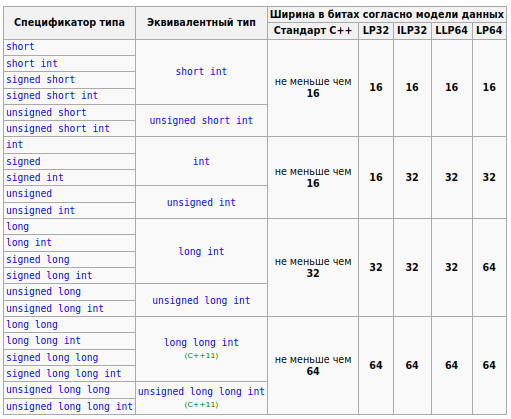

# Фундаментальные типы данных

C++ - это *сильно типизированный* язык. Это означает, что у каждой переменной, у каждой функции, ..., должен быть явно указан тип.

Из-за ошибок при работе с типами данных в `C` и в `C++` в истории человечества происходило множество страшных событий: от багов в играх до взрывающихся ракет и падающих самолётов (**буквально** - всё это разберём в дальнейших уроках).

Поэтому очень важно понимать, какие типы есть в С++ и как с ними работать.

## Что такое тип?
Справедливый вопрос, который зачастую не обговаривается (а зря).

Обсудим это на примере переменной.

**Тип** - это *свойство* переменной, которое определяет:
1. Операции, которые можно совершать над переменной (например, основные арифметические операции для целых чисел)
2. Набор значений, которые может принимать переменная данного типа.  Например, *обычно* переменная типа `int` может принимать значения от `-2 147 483 647` до `2 147 483 647`. Или, например, булева переменная (`bool`) может принимать значение только `true` или `false` (1 или 0).

Пример того, как мы указываем тип в C++:
1. При создании функций
```cpp
int sum(int a, int b)
{
	return a + b;
}
```
Здесь мы чётко указали, что функция с именем `sum` принимает на вход два целых числа и как результат выполнения тоже возвращает целое число

2. При объявлении переменных
```cpp
std::string name;
```
Здесь мы чётко указали, что переменная с именем `name` имеет тип `std::string` (то есть, это строка).

## Переменные в памяти компьютера
Вообще, память компьютера упрощённо можно представить как бесконечную ленту из 0 и 1:
```
01010101000100100011110100101010010101010...
```
> (конечно, на самом деле это не так, но в рамках курса такое объяснение вполне допустимо).


Какая-то часть этой "ленты" используется запущеными приложениями, какая-то нет.

Итак, предположим, что у нас в памяти компьютера по какому-то адресу лежит переменная.Это будет выглядеть примерно так:
```
...[10011101]...
```
То есть, у нас выделен определённый фрагмент, в который потом записали обозначенные данные.

И без *типа* данных вот эта последовательность нулей и единиц (бит) не имеет **никакого смысла**. Может быть, тут зашифрован символ в какой-то кодировке. Может, здесь зашифровано целое число. А может дробное. А может это вообще какой-то специальный крутой шифр, в котором закодирован пароль запуска ядерных боеголовок - мы не знаем. В такой ситуации, эти данные для нас только мусор.

**Тип данных** наделяет эту последовательность бит *смыслом*, и определяет то, как с этими данными можно работать. Это важно и для пользователя, который будет работать с переменной, и для компьютера, который будет выполнять над этими данными какие-то машинные операции (переместить в регистр/сложить с другим регистром/скопировать значение в другую область памяти/...).

## Какие в С++ бывают типы?
> [!quote] Страуструп Б. - Программирование. Принципы и практика с использованием C++
> В языке С++ предусмотрен довольно широкий выбор типов (см. раздел А.8). Однако можно создавать прекрасные программы, обходясь лишь пятью из них.
> ```cpp
> int number_of_steps = 39; // int - для целых чисел
> double flyinq_time = 3.5; // double - для чисел с плавающей точкой
> char decimal_point = '.'; // char - для СИМВ ОЛОВ
> string name = "Annemarie"; // string - для строк
> bool tap_on = true ; // bool - для логических переменных
> ```

Но всё же, рассмотрим представленные в C++ типы чуть подробнее.

### Общее деление типов
[Согласно документации](https://ru.cppreference.com/w/cpp/language/type), типы в C++ делятся на:
1. **Фундаментальные** - совсем простые типы, без которых никуда не деться (`int`, `char`, `double`, ...)
2. **Составные** - типы, которые, по сути, строятся на основе фундаментальных
### Фундаментальные типы
Фундаментальные типы - это самые простые типы языка C++, которые служат "кирпичиками" для построения более сложных, составных типов.
#### Целые числа (int)
Целые числа в С++ задаются ключевым словом `int`. Пример:
```cpp
int a = 1; // a - целое число
```

##### Вычисление границ инта 
*Обычно*, переменная `int` занимает 4 байта.

В памяти целое число хранится просто в виде его представления в двоичной системе счисления.
Например, число `5` в памяти будет хранится как `101`.

Из этого следует, что мы можем посчитать, какое максимальное число можно уместить в переменной типа `int`:
- 4 байта - это \\(4 \times 8 \\) = 32 бит
- Целое число может быть и отрицательным - поэтому 1 бит уходит на хранение знака числа (Если первый бит - 1, то число отрицательное, 0 - положительное). Итого на хранение *самого числа* остаётся 31 бит.
- 31 бит соответствует числу в двоичной системе счисления, которое может состоять максимум из 31-го символа.
- Максимальное десятичное число, которое в двоичной системе счисления будет занимать *не больше 31-го символа* можно вычислить как:
\\[
x = 2^{31} - 1 = \text{2 147 483 648} - 1 = \text{2 147 483 647}
\\]

Получается, что целые числа (с учётом знаковости) могут принимать значения *от `-2 147 483 647` до `2 147 483 647`*.

##### Спецификаторы типа

Для типа `int` можно задавать *спецификаторы типа* - это специальные ключевые слова, которые *уточняют* тип переменной `int`. Давайте разберёмся, какие они бывают.
1. Уточняющие *знаковость* целового числа (может ли число быть положительным или нет) - `signed` и `unsigned`. `int` по умолчанию `signed`.
2. Уточняющие *размер* числа - `short`, `long`, `long long`. Так мы можем определить, с насколько большим целым числом мы хотим работать (и, соответственно, сколько памяти нужно выделять для хранения этого числа).

Если число будет *беззнаковое* (`unsigned`), то в нём для хранения *самого числа* выделяется уже не 31, а 32 бита (так как отдельный бит для хранения знака уже не нужен). Получается, числа `unsigned int` могут лежать в пределах от `0` до \\( 2^{32} - 1 = \text{4 294 967 296} - 1 = \text{4 294 967 296}\\).

По поводу размеров `int` *обычно* работает следующая шкала:
- `short int` - 2 байта
- `int` - 4 байта
- `long int` - 8 байт
- `long long int` - 16 байт

Для этих типов диапазоны значений высчитываются аналогично. При желании, их можно самому легко посчитать в калькуляторе, или банально нагуглить.

...с помощью спецификаторов можно задавать переменные типа `int` самыми разными способами:
```cpp
int a;
short int b;
short c;
long d;
long long e;
signed int f;
unsigned int g;
unsigned long long int h;
// и т.д.
```
То есть, можно как угодно сочетать спецификаторы, определяющие размер и знаковость числа. Так же можно опускать при определении типа слово `int`, если уже используется, например, `long long` или `signed`.
##### *Реальный* размер инта
Очень тонкий момент заключается в *размере `int`*. Да, *обычно*, размеры `int` такие, как я написал. Но это только обычно, а не всегда. На самом деле, размер `int` может различаться на разных платформах! Это определяется разрядностью и архитектурой процессора, и другими особенностями. Если взглянуть в [официальную документацию C++,](https://ru.cppreference.com/w/cpp/language/types) то размеры `int` там определены следующим образом:



Обратите внимание на словосочетание: "не меньше чем". Стандарт С++ не гарантирует точный размер переменной типа `int`! По таким ограничениям, `short int` может быть такого же размера, как `int`.

Почему же существует такая путаница и неразбериха? Потому что C++ позволяет очень "близко" (*на низком уровне*) работать с целевой машиной, на которой работает программа. Поэтому такой базовый тип, как `int`, и зависит от аппаратных возможностей конкретного конкретного компьютера, на котором будет собрана и запущена программа.

Но всё не так плохо! Если мы захотим, мы можем создать переменную `int`, которая будет ровно того размера, который нам нужен.

Чтобы **чётко** указать компилятору, что мы хотим переменную `int` размером в столько-то байт, существуют специальные типы:
```cpp
int32_t a; // Переменная signed int размером 32 бита (4 байта)
int8_t b; // Переменная signed int размером 8 бит (1 байт)
uint16_t c; // Переменная unsigned int размером 16 бит (2 байта)
```

На самом деле, это не отдельные типы, а просто заранее определённые `typedef`-псевдонимы. Они на этапе компиляции "подгоняются" под целевую машину, и, например, вместо `int16_t` на этапе компиляции может подставиться `short int`. Что такое `typedef`, мы разберём подробнее позже.
#### Числа с плавающей точкой
...или же дробные числа, или же вещественный числа, или же числа со знаками после запятой.

Для хранения вещественных чисел в C++ используется 3 типа данных:
- `float`
- `double`
- `long double`

С целыми числами все понятно, как они хранятся в памяти: это просто последовательность бит, которая в двоичной системе соответствует целому числу. Последовательность бит `10` означает \\( 2_{10}\\), `11` - \\(3_{10}\\), и так далее.

Хранить же дробное число, так же как и выполнять с ним какие-то операции, на уровне бинарной арифметики, достаточно сложно и неудобно. Отсюда зачастую можно встретиться вот с таким интересным поведением программ (и не только на языке C++):
```cpp
float f = 0.6;
std::cout << (f/2  == 0.3); // 0 (false)
```

На эту тему можно посмотреть [отдельный ролик](https://www.youtube.com/watch?v=2gIxbTn7GSc).

Здесь же скажем коротко: существуют специальные стандарты, которые определяют, как в компьютере будет храниться дробное число, и которые определяют допустимый размер дробного числа. 

Выдержка из документации касательно стандартов представления дробных чисел:

> [!quote] cppreference.com
> - float - тип с плавающей запятой одинарной точности. Соответствует [формату IEEE-754 binary32](https://tftwiki.ru/wiki/Single-precision_floating-point_format), если поддерживается.
> - double - тип с плавающей запятой двойной точности. Соответствует [формату IEEE-754 binary64](https://tftwiki.ru/wiki/Double-precision_floating-point_format), если поддерживается.
> - long double - тип с плавающей запятой повышенной точности. Соответствует [формату IEEE-754 binary128](https://datewiki.ru/wiki/Quadruple-precision_floating-point_format), если поддерживается, в противном случае соответствует [IEEE-754 binary64-расширенному формату](https://star-wiki.ru/wiki/Extended_precision), если поддерживается, иначе соответствует некоторому расширенному формату с плавающей запятой, отличному от IEEE-754, если его точность лучше, чем binary64, и диапазон не менее хорош как binary64, иначе соответствует формату IEEE-754 binary64.

Размеры для этих типов распределяются так:
- `float`: представляет вещественное число одинарной точности с плавающей точкой в диапазоне `+/- 3.4E-38 до 3.4E+38`. В памяти занимает 4 байта (32 бита)    
- `double`: представляет вещественное число двойной точности с плавающей точкой в диапазоне `+/- 1.7E-308 до 1.7E+308`. В памяти занимает 8 байт (64 бита)   
- `long double`: представляет вещественное число двойной точности с плавающей точкой не менее 8 байт (64 бит). В зависимости от размера занимаемой памяти может отличаться диапазон допустимых значений
#### Символьные типы
##### char
Для представления символов в C++ используется тип *char*.

Символы в языке C++ обозначаются через одинарные кавычки:
```cpp
char a = 'D';
```

Обратите внимание, что в C++ существует чёткое разделение между символами и строками (в отличие от того же питона). Поэтому *символы* обозначаются здесь *одинарными кавычками*, а *строки* - *двойными*.

Для хранения текста в памяти компьютера вообще (в отрыве от С++) существует огромное число разных *кодировок*:
- ASCII
- KOI8R
- Windows1251
- UTF8 / UTF16 / UTF32
- ...

В C++ для типа `char` используется очень простая кодировка `ASCII`. В этой кодировке самым основным символам предоставляется численный код от 1 до 127:


Благодаря этой кодировке, `char` занимает в памяти только 1 байт. Но с помощью него нельзя хранить специальные символы (эмодзи, математические символы), или символы из алфавитов разных языков (например, иероглифы).

В кодировке `ASCII` каждому симолу просто присваевается какое-то число от 0 до 127. Таким образом, символ "!" может быть закодирован как число 33, символ "N" как число 78, и так далее.

Ну и, соответственно, символ в кодировке `ASCII` **в памяти будет хранится как то же самое целое число**. Или же, другими словами, последовательность бит, в виде которой хранится в памяти переменная `char`, соответствует коду сивола в таблице `ASCII` в двоичной системе счисления.

По этой причине, значения типа `char` могут использоваться вместе с целыми числами:
```cpp
int D_ascii_code = 'D'; // Будет хранить 68 - код 'D' в таблице ASCII
char a = 33; // В переменную a запишется символ с ASCII-кодом 33. То же самое, что a = '!';
int b = a + 15; // здесь вместо a подставится ASCII-код лежащего там символа. b = 33 + 15 = 48
char c = 'A' + 1; // После символа 'A' в таблице ASCII лежит символ 'B'. c = 'A' + 1 = 65 + 1 = 66 = 'B'
```

Формально, `char` может принимать отрицательное значение (1 бит в его двоичном представлении выделяется на знак). Можно объявить переменную с типом `unsigned char`, тогда она будет принимать значения от 0 до 255.

Но правило в этом плане следующее: **всегда используйте только `char`; `unsigned char` используйте только в тех редких случаях, когда вы очень чётко представляете, зачем вам это нужно**.

У использования `char` для хранения символов есть некоторые минусы:
- Реализация `char`, так же как и `int`, различается на разных платформах.
- С помощью `char` можно хранить только очень небольшой перечень доступных символов

Для решения второй проблемы существует отдельный тип - `wchar_t`, или же "широкий char".

##### wchar_t
С помощью этого типа мы можем хранить и выводить на экран хоть эмодзи, хоть иероглифы.

"Под капотом" в `wchar_t` хранятся символы в кодировке `Unicode`.

---
**Пару слов про Unicode**.
Юникод работает по тому же принципу, что и ASCII - каждому символу присваевается какой-то код, и в конечном итоге число в памяти компьютера хранится как этот код.

В отличие от ASCII, в юникоде поддерживается намного больше символов (десятки тычяч против 128).

Также, у юникода есть несколько разновидностей:
1. `UTF-8`. В этой кодировке каждому символу в памяти выделяется **ЛИБО** 8, **либо** 16, **либо** 32 бита. То есть, размер символа в этой кодировке - непостоянный.
2. `UTF-16`. В этой кодировке каждому символу в памяти выделяется либо 16, либо 32 бита
3. `UTF-32`. В этой кодировке каждый символ занимает в памяти чётко 32 бита.

Про кодировки `UTF-8` и `UTF-16` говорят, что символы в этих кодировках
*соответствуют какому-то количеству кодовых единиц*:  
- Символы в `UTF-16` могут занимать одну (16 бит) или две (32 бита) кодовые единицы.
- Символы в `UTF-8` могут занимать одну (8 бит), две (16 бит) или четыре (32 бита) кодовые единицы.

> [!question]
> Почему 32 бита в `UTF-16` соответствуют 4 кодовым единицам, а не 3?

...зачем же нам нужен непостоянный размер символов в кодировке?
Это помогает сократить использование памяти: для символов, которые спокойно умещаются в 1 байт 
(их номер не превосходит 255), не придётся выделять в памяти лишние 3 байта.

Но, одновременно с этим, увеличивается сложность обработки текста с непостоянным количеством
бит на каждый символ.


---

...из-за того, что `wchar` использует `unicode`, стоит понимать, что он *принципиально* отличается от `char`, и просто так *заменить* один тип на другой не получится, потому что алгоритм работы с разными кодировками сильно различается.

Например, вот так будет выглядеть вывод одного символа с использованием `wchar_t`:
```cpp
#include <iostream>

int main()
{
	wchar_t symbol = L'🍌';
	std::wcout << symbol << std::endl;
}
```

Здесь можем заметить сразу несколько вещей:
1. Для `wchar_t` нужно использовать специальный поток `wcout`
2. Для обозначения шикроких символов нужно писать `L''` - подробнее об этом расписано в статье про литералы

Если попытаться в коде выше заменить `wcout` на `cout`, компилятор откажется компилировать этот код.

Но у `wchar_t` есть один минус: "под капотом" у него не всегда используется одна и та же вариация юникода.  
Например, на Linux-машинах это обычно `UTF-32` - `wchar_t` занимает 32 бита и поддерживает все доступные в юникоде символы.
На Windows-машинах же зачастую используют 16 бит для представления символов, и поэтому в `wchar_t` помещаются не все юникод-символы.

Эту проблему видно даже на нашем примере: если в системе, на которой запускается этот код,
для `whcar_t` используется 16 бит, код эмодзи просто в них не поместится, и на экран выведется мусор. 

##### char8_t, char16_t и char32_t

Для тех случаев, когда мы чётко хотим определить используемую кодировку, используются типы `char8_t`, `char16_t` и `char32_t`.

- В `char8_t` хранятся символы `UTF-8`, **которые помещаются в 8 бит**
- В `char16_t` хранятся символы `UTF-16`, **которые помещаются в 16 бит**
- В `char32_t` хранятся символы `UTF-32`. `char32_t` в памяти занимает 32 бита.

В коде их использование может выглядеть примерно так:
```cpp
	char8_t C1 = u8'a';
	//  char8_t C2 = u8'¢';   // ошибка: ¢ соответствует двум кодовым единицам UTF-8
	//  char8_t C3 = u8'猫';  // ошибка: 猫 соответствует трём кодовым единицам UTF-8
	//  char8_t C4 = u8'🍌';  // ошибка: 🍌 соответствует четырём кодовым единицам UTF-8
 
    print("\n" "UTF-16 character literals:");
    char16_t uc1 = u'a';
    char16_t uc2 = u'¢';
    char16_t uc3 = u'猫'; 
	// char16_t uc4 = u'🍌'; // ошибка: 🍌 соответствует двум кодовым единицам UTF-16 
 
    print("\n" "UTF-32 character literals:");
    char32_t Uc1 = U'a'; 
    char32_t Uc2 = U'¢'; 
    char32_t Uc3 = U'猫';
    char32_t Uc4 = U'🍌';
```
(пример с `cppreference`).

Вообще, нам в курсе эти типы вряд ли потребуются, но полезно знать, что это такое и зачем оно нужно.

#### Логический тип
Для представления булевых/логических значений, в C++ используется тип `bool`.

Переменные типа `bool` могут принимать только два значения: `true` или `false` (1 или 0).

Пример использования:
```cpp
bool a = true; // 1
bool b = false; // 0
bool c = a | b; // 1 | 0 = 1
```

В памяти `bool` занимает один байт. Возможно, у вас возникнет вопрос, почему не один бит, ведь `bool` по сути хранит только один или ноль.  
Ответ на этот вопрос достаточно сложный, но если попытаться ответить на него коротко, то компьютер не может так дробить память, чтобы выдавать нам ровно 1 бит под хранение переменной. 1 байт - это минимальный размер "долек", на которые компьютер может "дробить" память.

### Составные типы
Это типы, которые являются "надстройками" над фундаментальными типами. К таким типам можно отнести:

1. Указатели и ссылки
2. Массивы
3. Функции и функторы
4. Перечисления
5. Классы

Что это всё такое, сейчас разбирать не будем, потому что, по сути, больш**а**я часть нашего курса как раз и посвящена обсуждению того, что это за такие типы `:)`

### Бонус: std::string

Чтобы полностью *осознать*, что из себя представляет на самом деле `std::string`, нам потребуется ещё несколько уроков, но пока, чтобы создавать минимально функциональные приложения, можно просто запомнить, как его использовать.

`std::string` используется для хранения строк в `C++`. Стоит понимать, что **это не фундаментальный тип** - ведь `std::string` является не чем-то отдельным, а просто надстройкой над `char`.

Пример использования `std::string`:
```cpp
int main()
{
    std::string name = "Maxim";

    std::cout << "Hi, " + name << " !" << std::endl;
}
```


## Источники
1. [Статья про типы из оф. документации](https://en.cppreference.com/w/cpp/language/types)
2. Программирование. Принципы и практика использования C++ - Бьерн Страуструп
3. [Статья про фундаментальные типы из оф. документации](https://ru.cppreference.com/w/cpp/language/types)
4. [Видео про дробные числа (Why Is This Happening?! Floating Point Approximation)](https://youtu.be/2gIxbTn7GSc)
5. [IEEE 754-2008 - вики](https://ru.wikipedia.org/wiki/IEEE_754-2008)