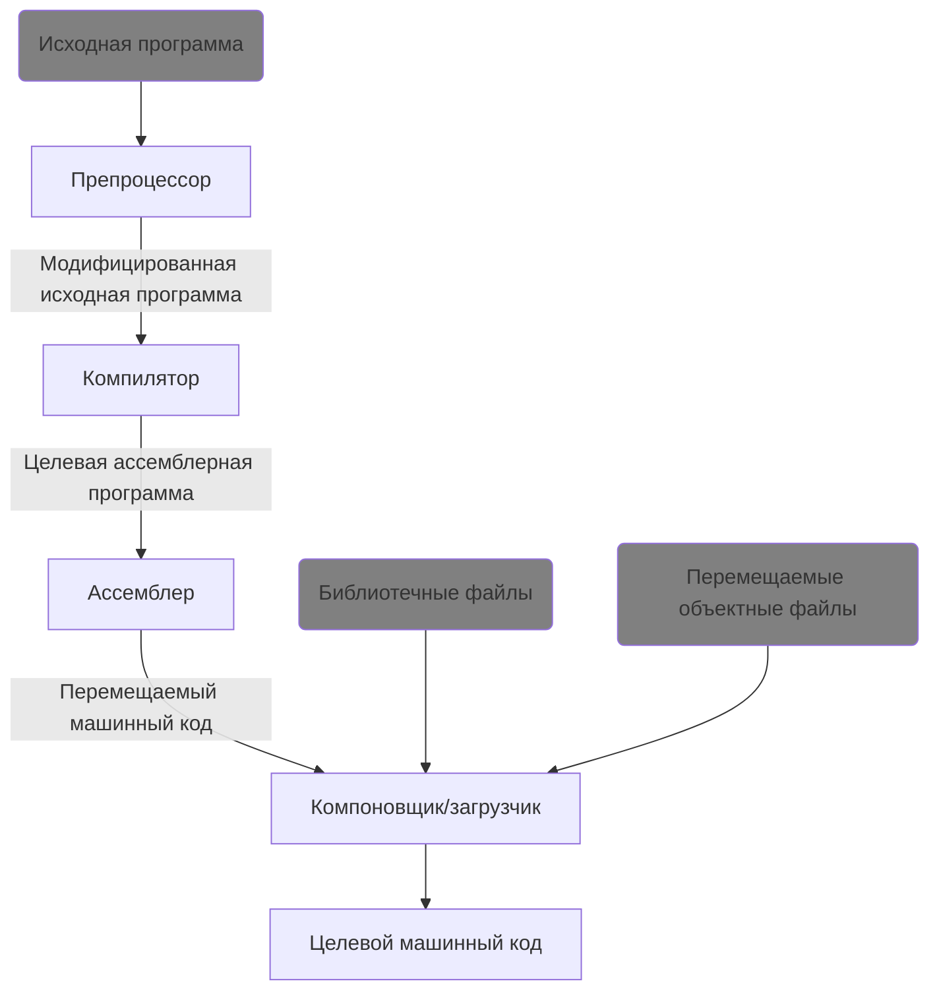

# Компиляция и сборка программ на C++ [в разработке]

В статье о языковых процессорах мы обсуждали, что это такое, обсуждали компоненты языковых процессоров, такие как, например, компиляторы и интерпретаторы, а также косвенно затронули C++. 

Давайте подробнее рассмотрим, как выглядит компиляция и сборка программы на C++.

## Общая схема
Вспомним, как выглядит обработка исходного кода на языке C++:

Как видим, здесь у нас существуют не только 