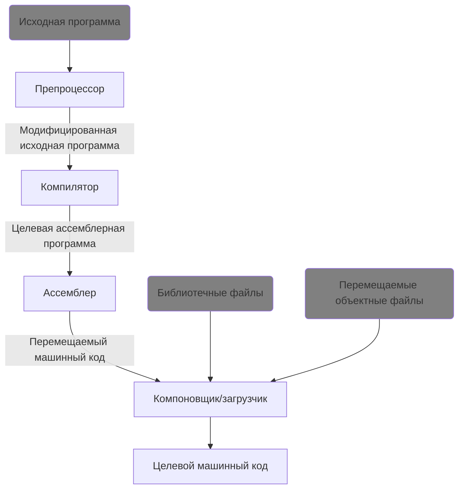

# Компиляция и сборка программ на C++ [в разработке]

При написании программ на С++ критически важно понимать, как из исходного кода генерируется готовая программа.

C++ - это компилируемый язык, что значит, что программы на C++ компилируются в готовый исполняемый файл. Но на самом деле, в процессе генерации исполняемого файла учавствует не только один компилятор.

Давайте рассмотрим процесс обработки исходного кода на С++ подробнее.

## Общая схема

На этой схеме есть много новых понятий - препроцессор, компоновщик, ассемблер. Рассмотрим каждое из них подробнее.