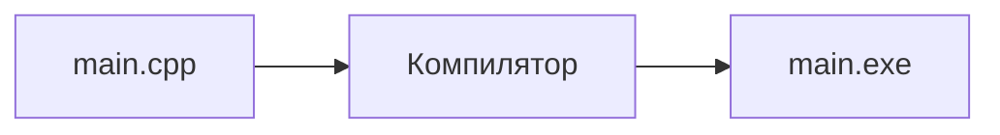
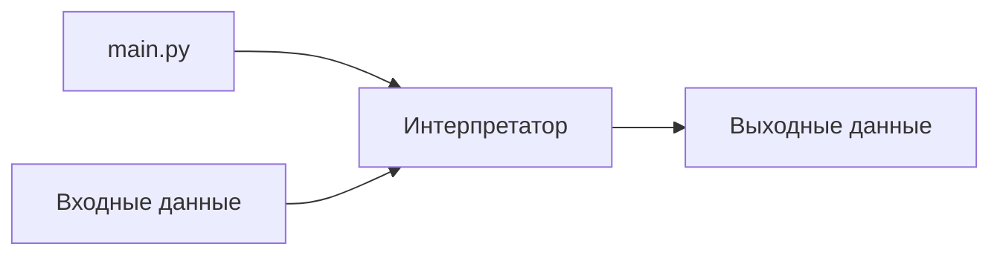
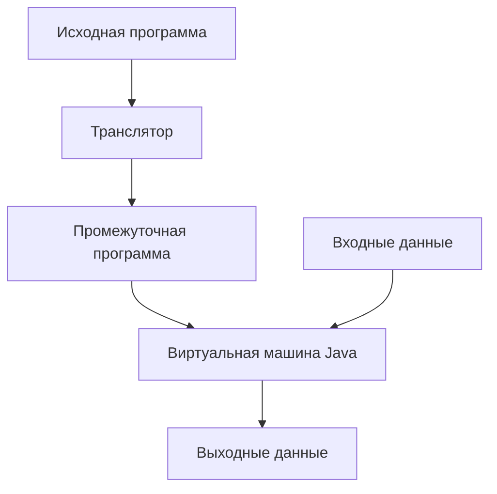
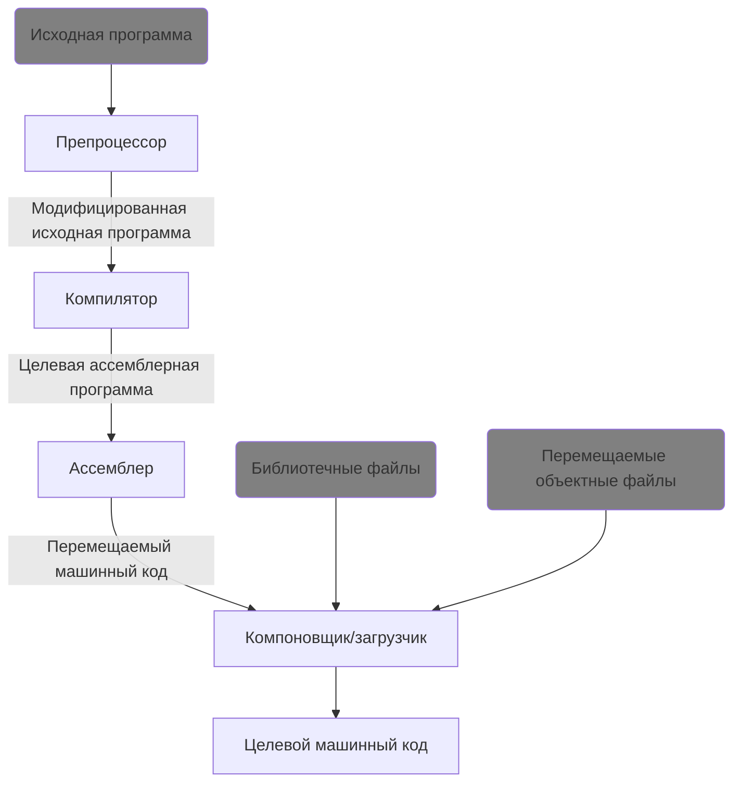

# Языковые процессоры

**Языковой процессор** - это механизм, который отвечает за перевод инструкций из кода на языке программирования (ЯП) в машинный код, который будет исполняться на конкретной машине.

Далее мы рассмотрим, какие они бывают, и как они примерно работают.

## Почему это важно

Обычно, в схожих обучающих материалах ничего не говорят про процесс сборки готовой программы и языковые процессоры. Авторы ограничиваются тем, что просто показывают, в какой последовательности нужно нажимать кнопки в среде разработки (IDE), чтобы программа "заработала". 

Я считаю, что перед первой строчкой написанного когда, человек должен чётко понимать, как записанные на ЯП инструкции будут выполнены на компьютере. 

В пользу своей точки зрения, приведу несколько аргументов, почему первый подход вреден:

1. Окей, вот ты зазубрил, куда надо нажимать в IDE, чтобы запустить проект. А что если в процессе вылезет какая-то ошибка? Как ты будешь с этим работать? Остаётся единственный вариант - либо звать препода, либо выполнять туториалы из гугла наугад, надеясь что всё заработает. Подход не очень классный. В лучшем случае ты на основе проб и ошибок поймёшь то, что мог бы понять заранее намного быстрее.
2. Понимание процесса генерации исполняемого файла необходимо для понимания того, как работает даже самая простая `Hello World` программа на С++. И мы это дальше увидим.
3. Рано или поздно, когда потребуется собрать сложный проект из нескольких модулей, вам **придётся** разбираться с тем, как работает сборка и компиляция.

## Компилятор
**Компилятор** - это специальная программа, которая переводит код на ЯП в машинный код, который потом уже исполняется на компьютере. 

То есть, при помощи компилятора мы из исходного кода получаем готовую программу - например, на `Windows` это будет готовый `.exe` файл.

Процесс генерации машинного кода из исходного назвается **компиляцией**, а языки, код на которых обрабатывается компилятором, называются **компилируемыми**.

Алгоритм работы компилятора упрощённо можно представить так:

Когда мы компилируем код в готовую программу, мы имеем возможность полностью просканировать содержимое программы до её сборки и запуска, и, соответственно, найти ошибки в коде.  
Также само выполнение программы будет быстрее, чем в случае с *интерпретатором*, так как все инструкции из исходного кода были преобразованы и **оптимизированы** во время компиляции.

Но, у сборки программ при помощи компилятора есть и свои недостатки, как, например, сильная зависимость от целевой платформы и долгое время компиляции.
## Транслятор
Транслятор работает примерно так же, как и компилятор, за тем лишь исключением, что транслятор переводит исходный текст программы не в машинный код, а в код на другом ЯП.

С помощью транслятора, при создании языкового прцоессора для какого-то языка, нам не нужно с нуля писать абсолютно всю логику переноса исходного кода в машинный - часть ответственности за этот процесс можно делегировать готовому компилятору.

Также использование транслятора может помочь при создании процессора для своего небольшого языка, как, например, Seed7, или эзотерических языков по типу Brainfuck, Piet и прочих.

## Интерпретатор
Существует также и другой подход к исполнению инструкций исходного кода, который применяется, например, в питоне.

В отличие от компилятора, **интерпретатор**, вместо получения готовой программы, непосредственно выполняет операции, указанные в исходной программе, над входными данными, которые предоставляет программе пользователь.

Языки, код на которых выполняется при помощи интерпретатора, назваются **интерпретируемыми**.

Алгорит работы интерпретатора упрощённо можно представить так:

Код на интерпретируемых языках программирования зачастую лучше портируется между системами, + не требует дополнительных затрат времени на компиляцию.

Но интерпретируемые программы из-за свой архитектуры, как правило, работают менее эффективно, чем заранее скомпилированные программы, + мы не можем заранее оптимизировать или проанализировать исходный код так же эффективно, как при использовании компилятора.

## Смешанные системы
На самом же деле, достаточно редко для какого-то ЯП используется либо **только** компилятор, либо **только** интерпретатор. Обычно это *смешанный* системы.

Самым ярким примером является Java. Хоть с этим языком есть много тонкостей, примерно выполнение программы на Java можно представить себе так:

Ещё стоит отметить, что даже те языковые процессоры, которые, казалось бы, используют только компилятор, на самом деле выглядят чуть сложнее.

Например, тот же C++, который является компилируемым языком, на самом деле обрабатывается примерно следующим образом:

Подробнее будем рассматривать процесс обработки кода на C++ в другой статье.