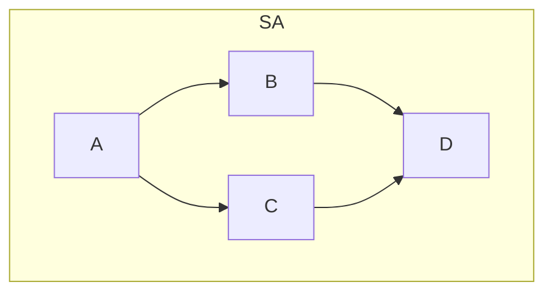

# Виртуальные функции [в разработке]
[Отрывок с собеса на YouTube](https://www.youtube.com/watch?v=ev3e5huqe_E)
Предположим, у нас есть класс `Mammal`:
```cpp
class Mammal {
public:
	void speak()
	{
		cout << "I'm Mammal\n";
	}
};
```

И мы от него наследуем класс `Cat`:
```cpp
class Cat : public Mammal {
public:
	void speak()
	{
		cout << "Meow\n";
	}
}
```
Предположим, что после всех этих операций, например, в функции `main`, мы запустим код:
```cpp
Cat cat;
cat.speak();
```
В итоге у нас в консоль выведется строка `Meow`.
В данном случае мы *сокрыли имя базового класса*.
Если нам нужно будет запустить именно функцию из родительского класса, мы можем как-то переименовать функцию `speak` в классе `Cat`, ну или сделать так:
```cpp
Cat cat;
cat.Mammal::speak();
```
Но в некоторых случаях нам нужно иметь доступ к *полиморфизму*.
Хочется обращаться к объекту через указатель на базовый класс, ну или через ссылку на базовый класс.
Например, было бы полезно иметь `std::vector` с объектами разных классов, унаследованных от класса `Mammal` (массив собак, кошек, и вообще кого угодно).

Если для текущего примера мы напишем следующий код:
```cpp
unique_ptr<Mammal> cat = make_unique<Cat>();
cat->speak();
```
На экран будет выводится строка `I'm Mammal`.

Что происходит, когда в нашем нерабочем примере вызывается `cat->speak()`? 
Во время выполнения программы рантайм видит, что просто происходит вызов функции `speak()` объекта класса `Mammal`. Происходит `раннее связывание`. Мы ранним связыванием связываем имя нашей функции с её адресом.

Чтобы наш код работал, нам и нужен механизм **виртуальных функций**.

Всё меняется, если мы добавляем ключевое слово `virtual` к объявлению функции `speak` в классе `Mammal`.  Тут уже будет производиться `позднее связывание`, то есть `связывание через указатель`. 
Для функции `speak` в дочернем классе можно дописать `override`: c С++11 это хорошая практика. Но вообще, если в родительском классе функция определена как `virtual`, то функция с таким же *заголовком (хз правильно ли так говорит)* в дочернем классе тоже автоматически будет виртуальной.

У каждого класса будет своя виртуальная таблица, в которой для каждой виртуальной функции будет записываться адрес этой функции.
Эту таблицу можно увидеть в дебаггере как отдельное поле `void *vfptr` (возможно тип не `void`, но сути не меняет).

Таким образом, для нашего примера, у классов `Mammal` и `Cat` будут созданы виртуальные таблицы, в которых для функции `speak` будут свои записи.
Когда мы проинициализируем указатель на `Mammal` как полиморфный класс типа `Cat`, в виртуальную таблицу класса `Mammal`, по аналогии с аргументом конструктора, будут записаны адреса функций для дочернего класса. И при выполнении тестового кода на экран будет выводиться уже `Meow`.
## Чисто виртуальные функции
### В общих чертах
Если мы не хотим, чтобы в родительском классе была реализация виртуальной функции, и хотим, чтобы все дочерние классы принудительно переопределяли её, мы можем использовать чисто виртуальные функции:
```cpp
virtual void speak() = 0;
```
Класс с чисто виртуальной функцией будет называться абстрактным.
Создавать объекты абстрактных классов запрещается (по понятным причинам).
### Зачем нужны
- Определение интерфейса
- Предотвращение создания экземпляров базового класса
- Поддержка полиморфизма
### pure virtual call
У нас могут быть проблемы, если мы в конструкторе абстрактного класса попытаемся вызвать чисто виртуа льную функцию: потому что на этапе выполнения кода ещё может просто "не создасться" дочерняя переопределённая функция, и произойдёт ошибка.
Если попробовать вызвать чисто виртуальную функцию напрямую в конструкторе, нам даже не дадут скомпилировать программу. Но если это как-то спрятать от компилятора (например, вызвать чисто виртуальную функцию через другую функцию в конструкторе), то программа скомпилируется и произойдёт ошибка вызова чисто виртуальной функции (программа аварийно завершится).
Проблема тут, опять же, в том, что конструктор *базового* (в данном случае абстрактного) класса вызовется раньше, чем конструктор дочернего класса. Отсюда и проблема с тем, что в виртуальной таблице класса функция будет ссылаться на какой-то мусор.
## Зачем нужен виртуальный деструктор
[easyoffer](https://easyoffer.ru/question/3861)
Нужен чтобы гарантрировать, что в дочернем классе, созданном полиморфно от родительского класса, будет вызван именно дочерний деструктор.
**Вызов цепочки деструкторов:** Виртуальный деструктор гарантирует, что при удалении объекта через указатель на базовый класс сначала вызовется деструктор производного класса, а затем деструкторы всех базовых классов по цепочке наследования
Виртуальный деструктор необходим, если:

- Вы работаете с наследованием и объектами базового класса могут быть расширены в производных классах.
- Вы удаляете объекты через указатель на базовый класс.

Просто так помечать деструктор в классе как `virtual` не надо.
## Что такое виртуальное наследование?
[easyoffer](https://easyoffer.ru/question/4158)
[Владимир Балун](https://www.youtube.com/watch?v=2ZZDA0mB2Ts)
Вообще, если полиморфно создавать от базового класса классы-наследники, то в каждом дочернем классе будет создан "внутри" родительский класс.
Но что же происходит, если у нас происходит ромбовидное наследование?

В таком случае у нас *по идее* создался бы объект класса A внутри объектов классов B и C, и потом внутри класса D по объекту классов B и С.
Какие же у такой ситуации проблемы?
- Два раза хранится один и тот же класс A
- Два раза будет вызываться конструктор и деструктор класса A
Как избежать таких проблем? С помощью **витруального наследования**!
```cpp
class B : virtual A {};
```
Что же будет тогда в памяти по классу D?
```cpp
void *vbptr; // указатель класса B на родительский
int b_data;
void *vbptr; // указатель класса C на родительский
int c_data;
int d_data;
int a_data; // в самом конце класс на который ссылаются B и C
```

